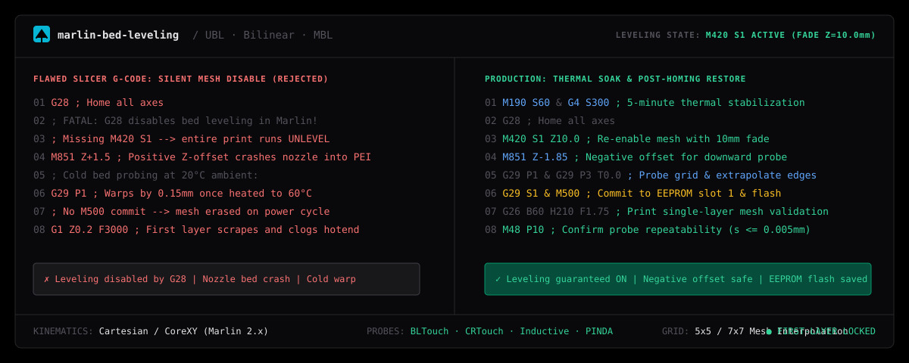

# marlin-bed-leveling

Autonomous 3D Printer Bed Leveling & First-Layer Calibration Specialist for AI coding agents (Claude Code, Cursor, Antigravity, Windsurf).

Master Marlin 2.x firmware leveling systems (Unified Bed Leveling UBL, Bilinear ABL, Manual Mesh MBL) to guarantee flawless first-layer squish and adhesion through deterministic G-code phase workflows, probe offset math, and persistent EEPROM compensation.

```bash
npx skills add wwewtech/marlin-bed-leveling
```

**[Live Showcase & 3D Mesh Visualizer](https://wwewtech.github.io/marlin-bed-leveling/)** • **[skills.sh](https://skills.sh/wwewtech/marlin-bed-leveling)** • **[SKILL.md](SKILL.md)** • **[GitHub](https://github.com/wwewtech/marlin-bed-leveling)**

---



---

## Why Marlin Bed Leveling?

Over 85% of FDM 3D printing failures—corner warping, first-layer peeling, nozzle bed scraping, and extruder clicking—stem from incorrect bed leveling compensation and wrong Z-probe offsets. Marlin's internal leveling architecture has subtle state invariants that cause general-purpose AI coding assistants to fail repeatedly:

- **The Fatal `G28` Homing Trap**: Executing `G28` (Home All Axes) at the start of a print silently turns bed leveling compensation **OFF** by default in Marlin. Omitting `M420 S1` immediately after `G28` runs the entire print on a raw uncompensated bed.
- **Positive Z-Probe Offset Catastrophe**: Recommending a positive Z-probe offset (`M851 Z+1.5`) on a downward-deploying probe (BLTouch, CRTouch), causing the firmware to drive the brass nozzle directly into the PEI build plate.
- **Cold Bed Probing Warpage**: Probing a 7x7 mesh while the aluminum bed is at room temperature (20°C), ignoring the non-linear $0.15\text{mm}$ thermal bowing that occurs when heated to 60°C or 100°C.
- **Unsaved EEPROM Mesh Discard**: Spending 25 minutes probing and manually fine-tuning a mesh without committing to flash via `G29 S1` and `M500`, wiping all calibration on the next power cycle.
- **Software-Fixing Gross Mechanical Tilt**: Attempting to use software mesh leveling to compensate for a 2.5mm physical slant across the gantry rather than tramming bed corners first.
- **Missing Mesh Fade Height**: Leaving `M420 Z` at 0, forcing the Z-axis leadscrew to wobble back and forth across all 200mm of a model's vertical height instead of fading smoothly over the first 10mm.

`marlin-bed-leveling` enforces deterministic calibration: 5-phase UBL state machines, pre-flight thermal soaking, probe repeatability testing (`M48`), paper feeler gauge offset calibration, and bulletproof slicer start G-code sequences.

---

## Transformation in Action

### Before: Broken Slicer Start G-Code
```gcode
; Faulty start G-code: G28 disables leveling compensation!
G28                    ; Home axes (turns bed leveling OFF)
M851 Z1.5              ; FATAL: positive offset crashes nozzle into bed!
G1 Z0.2 F3000          ; First layer scrapes and ruins PEI sheet
```

### After: Production UBL Calibration Sequence
```gcode
; Pre-heat and thermally soak bed for 5 minutes
M140 S60               ; Heat bed to 60°C
M104 S150              ; Nozzle pre-heat to 150°C (prevent oozing)
M190 S60               ; Wait for bed temperature
G4 S300                ; 300-second thermal soak

G28                    ; Home all axes (silently turns leveling OFF)
M420 S1 Z10.0          ; Restore UBL mesh from EEPROM & set 10mm fade height
M851 Z-1.85            ; Calibrated negative Z-offset for BLTouch

M109 S210              ; Heat nozzle to printing temperature
; Priming purge line along bed edge
G1 X0.1 Y20 Z0.28 F5000.0
G1 X0.1 Y200.0 Z0.28 F1500.0 E15
```

---

## Quick Installation

### 1. Via `skills.sh` / Vercel Skills CLI
```bash
npx skills add wwewtech/marlin-bed-leveling
```

### 2. Via Claude Code
```bash
claude skills add https://github.com/wwewtech/marlin-bed-leveling
```

### 3. For Google Antigravity
Clone or copy `SKILL.md` directly into your Antigravity skills directory:
```bash
# Windows
mkdir -p "$HOME\.gemini\config\skills\marlin-bed-leveling"
curl -sL https://raw.githubusercontent.com/wwewtech/marlin-bed-leveling/main/SKILL.md -o "$HOME\.gemini\config\skills\marlin-bed-leveling\SKILL.md"

# macOS / Linux
mkdir -p ~/.gemini/config/skills/marlin-bed-leveling
curl -sL https://raw.githubusercontent.com/wwewtech/marlin-bed-leveling/main/SKILL.md -o ~/.gemini/config/skills/marlin-bed-leveling/SKILL.md
```

### 4. For Cursor & Windsurf
Add `SKILL.md` to your workspace prompt context:
```bash
mkdir -p .cursor/skills/marlin-bed-leveling
curl -sL https://raw.githubusercontent.com/wwewtech/marlin-bed-leveling/main/SKILL.md -o .cursor/skills/marlin-bed-leveling/SKILL.md
```

---

## The 10 Banned Anti-Patterns

| Anti-Pattern | Manifestation in Slicer G-Code | Mandatory Production Counter-Rule |
| :--- | :--- | :--- |
| **The Forgotten `M420 S1`** | `G28` followed immediately by print. | Always place `M420 S1` (or `G29 A`) strictly after `G28`. |
| **Cold Bed Probing** | Running `G29 P1` with bed at 20°C. | Heat bed to printing temp and soak for $\ge 5$ minutes first. |
| **Positive Z-Probe Offset** | Setting `M851 Z+1.5` on a BLTouch. | Downward-deploying probes MUST have negative offsets (`M851 Z-...`). |
| **Unsaved Mesh Discard** | Probing a 7x7 mesh without running `M500`. | Commit mesh to EEPROM with `G29 S1` followed by `M500`. |
| **Software-Fixing Gantry Tilt** | Using UBL to bridge a 2.5mm physical skew. | Mechanically tram bed corners (`G35` / thumb screws) before probing. |
| **Blind Point Extrapolation** | Running `G29 P3` without checking borders. | Inspect boundary values with `M420 V` or `G29 T`. |
| **Cold Extruder G26 Test** | Running G26 pattern without nozzle heating. | Heat nozzle to printing temp (`G26 B60 H210 F1.75`). |
| **Loose Probe Mount Blindness** | Probing while BLTouch bracket has play. | Check mount rigidity; verify repeatability with `M48` ($s \le 0.005\text{mm}$). |
| **Excessive Fade Height** | Setting `M420 Z0` or `M420 Z50`. | Use `M420 Z10.0` for smooth fade-out over first 10mm. |
| **Blind Point Over-Editing** | Manually bumping points by 0.5mm via `M421`. | Clean the build plate or check for debris under PEI sheet first. |

---

## Core Mental Models & Axioms

1. **The Post-Homing Enable Mandate**: `G28` disables bed leveling by default in Marlin. Start G-code MUST include `M420 S1 Z10.0` immediately after `G28`.
2. **The 5-Phase UBL State Machine**:
   - Phase 1 (`G29 P1`): Automated grid probe.
   - Phase 2 (`G29 P2`): Manual feeler gauge edge probe.
   - Phase 3 (`G29 P3 T0.0`): Mathematical edge extrapolation.
   - Phase 4 (`G26` + `M421`): Validation print & micro-tuning.
   - Phase 5 (`G29 S1` + `M500`): Flash memory commitment.
3. **Thermal Equilibrium Pre-Flight**: Aluminum plates distort under heat. Always heat-soak the bed for $\ge 5$ minutes prior to calibration.
4. **Z-Probe Offset Negative Sign Rule**: For BLTouch/CRTouch/inductive sensors, the trigger point is lower than the nozzle tip; hence $Z\text{-offset} \le 0$.
5. **Probe Repeatability Invariant**: Confirm standard deviation $s \le 0.005\text{mm}$ using `M48 P10` before trusting mesh data.

---

## Production Archetypes & Presets

### Archetype 1: UBL Calibration Sequence
```gcode
M190 S60 & G4 S300        ; Heat soak bed to 60°C for 5 minutes
G28                       ; Home axes
G29 P1                    ; Automated probe
G29 P3 T0.0 & G29 P3 T0.0 ; Extrapolate unprobed perimeter points
G29 S1 & G29 A & M500     ; Save to slot 1, activate, commit EEPROM
```

### Archetype 2: Baby-Stepping Z-Offset Math
```python
def update_z_probe_offset(current_offset: float, baby_step_adjustment_mm: float) -> float:
    # If nozzle is too high (feeler paper loose), move nozzle down (more negative)
    # If nozzle is too low (feeler paper pinched), move nozzle up (less negative)
    new_offset = round(current_offset + baby_step_adjustment_mm, 3)
    assert new_offset < 0.0, "FATAL: Z-probe offset must be negative for BLTouch!"
    return new_offset
```

---

## The 7-Axis Pre-Emit Quality Gate

| Axis | Metric | Target Threshold |
| :--- | :--- | :--- |
| **1. Leveling Restoration** | Post-G28 command order | `M420 S1` strictly after `G28` |
| **2. Offset Polarity** | Z-probe sign | Negative ($Z \le 0$) for BLTouch/CRTouch |
| **3. Thermal State** | Bed stabilization | Heated soak $\ge 5\text{ minutes}$ |
| **4. EEPROM Persistence** | Flash commit | `G29 S1` followed by `M500` |
| **5. Fade Transition** | Compensation decay | `M420 Z10.0` configured |
| **6. Mechanical Baseline** | Physical tramming | Corner variance $\le \pm 0.1\text{mm}$ |
| **7. Probe Stability** | `M48` Repeatability | Standard deviation $s \le 0.005\text{mm}$ |

---

## Collections & Ecosystem Inclusion

`marlin-bed-leveling` is packaged according to the open Agent Skills specification:
- **[skills.sh Directory](https://skills.sh/wwewtech/marlin-bed-leveling)**: Categorized under 3D Printing, Hardware Calibration, and G-Code.
- **Anthropic & Claude Code**: Native support via `claude skills add`.
- **Google Antigravity**: Seamless multi-agent workflow integration.
- **Cursor & Windsurf**: Supported through `.cursorrules` and `.windsurfrules`.

---

## License

MIT © [wwewtech](https://github.com/wwewtech)
